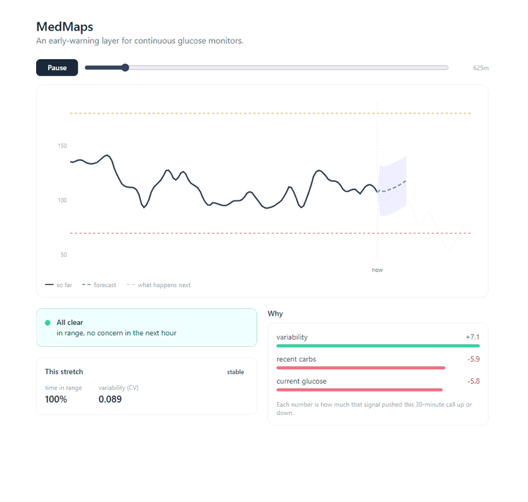

<!-- github.com/Ananyasdrafts/medmaps -->

# MedMaps

An early-warning layer for continuous glucose monitors. It spots a high or low before
it happens, tells you why, and would rather warn you early than miss a real low.

`status: phase 1 complete`

## demo

**[Try it live](https://ananyasdrafts.github.io/medmaps/)** (runs in your browser,
nothing to install).



Press play and watch a glucose stream move forward in time. The model forecasts ahead,
and the alert goes off before the low actually hits, with a reason and a phone
notification. The "this stretch" panel underneath is the drift watch, tracking
time-in-range and variability as they move. This is the explainer view to show what's
going on. In real life it would just be a notification on your phone.

## highlights

- a plain linear model beat a GRU and a TCN
- adaptive conformal held 85% coverage where textbook conformal broke (63%)
- 97% of predictions in the Clarke error grid's safe zones
- 78% of highs and lows caught at a 1% false-alarm rate

## what I found

Full tables are in [docs/eval-report.md](docs/eval-report.md), and the messier build
log is in [docs/rebuild-notes.md](docs/rebuild-notes.md).

- **simple beat deep.** I raced a few models, and a plain linear model and "just hold
  the last reading" both beat a GRU and a TCN at 30 and 60 minutes. Simple is hard to
  beat on time series.
- **the uncertainty degrades gracefully under shift.** I calibrated on two patients and
  tested on a third. Textbook conformal quietly fell to 63% coverage when it promised
  90%. Adaptive conformal (ACI) held it at 85%.
- **the glass-box model won anyway.** The most accurate one is a glass-box model on 10
  human-readable features, and its explanations are exact (0.977 on a faithfulness
  check), so every alert can actually say why instead of pointing at an attention map.
- **it does okay clinically.** About 97% of its predictions land in the safe zones of
  the Clarke error grid, and it catches 78% of highs and lows at a 1% false-alarm rate.

## the sketch

If you have diabetes, your CGM hands you a number every few minutes and almost no help
reading it. The moments that matter, a low overnight or your control slipping over a
few weeks, are the ones you catch too late.

The market already does basic threshold alerts. Here's what I wanted MedMaps to do that
they don't:

- **explain the alert.** Not just "low soon" but why: you're dropping fast, you've still
  got insulin on board, you're light on carbs. The reason changes what you actually do
  about it.
- **nag less.** If you already ate carbs that cover the low, it backs off. If a reading
  looks like sensor junk (a compression low, say), it says "check manually" instead of
  firing a confident wrong alarm. Fewer false alarms, same sensitivity.
- **watch the slow drift, not just the next 30 minutes.** Almost no CGM app tells you
  that your time-in-range has been slipping for weeks, your swings are widening, or your
  overall control is drifting. That's the signal I care about most, and the one nobody
  is measuring for you.
- **tune to the person.** It learns your own patterns instead of leaning on
  one-size-fits-all thresholds.

And it leans toward warning on purpose. In glucose care a missed low is far worse than a
false alarm, so when it's unsure it warns instead of going quiet.

## how it works

Five rules, each one there because it's a way these systems usually break:

1. **don't assume the fancy model wins.** I raced naive trend, ridge on lags, a TCN, a
   GRU, and N-HiTS on the same split and reported who actually won (a simple one).
2. **predict a range, not a single number.** Event risk is just how much of that range
   crosses the danger line, so the uncertainty isn't bolted on after.
3. **use the right kind of conformal.** Plain split conformal quietly breaks on time
   series, so I used adaptive conformal prediction (ACI), which holds its coverage as
   things shift.
4. **explanations you can actually trust.** No hand-waving at attention weights. A
   glass-box model on readable features, plus a check that the explanation is faithful.
5. **score it like a clinical tool.** Error grid, how early it catches events,
   false-alarm rate. Not just RMSE.

## run it

Backend (the first run pre-builds a small simulated cohort):

```bash
pip install -e .
PYTHONPATH=src python scripts/generate_cohort.py
PYTHONPATH=src uvicorn medmaps.api.app:app --port 8000
```

Frontend: `cd frontend && npm install && npm run dev` (opens on :5173).

Reproduce the findings with the scripts in `scripts/` (`race`, `abstain`, `explain`,
`clinical`). It's all tested and runs in CI.

## limitations

This runs on simulated glucose, not real patients yet. I used
[simglucose](https://github.com/jxx123/simglucose), an FDA-accepted simulator, on
purpose, so the whole repo is reproducible with no private health data and anyone can
just clone and run it. But a simulator is cleaner than real CGM (no sensor noise, no
compression lows, none of the real mess), and my cohort is small and one seed, so treat
the numbers as a starting bar, not a final word.

The drift watch is the lightest-validated piece. It's implemented and running (it's the
"this stretch" panel in the demo), but a few days of simulated data is too short to
really exercise weeks-long drift, so proving it out on long real-world records is part
of what's next.

## roadmap

- **phase 1 (done):** the whole glucose pipeline, model race, conformal abstention,
  glass-box explanations, clinical eval, the safety-first alerts, drift watch, light
  personalization, and the live dashboard.
- **phase 2 (next):** a second vital on the same spine, and better personalization.

The bigger milestone, and the honest gap from the limitations above, is validating on
real CGM data: [OhioT1DM](http://smarthealth.cs.ohio.edu/OhioT1DM-dataset.html) first
(the standard benchmark), then real-world records like OpenAPS and Tidepool. That's what
turns this from "promising on a simulator" into "works on people."
